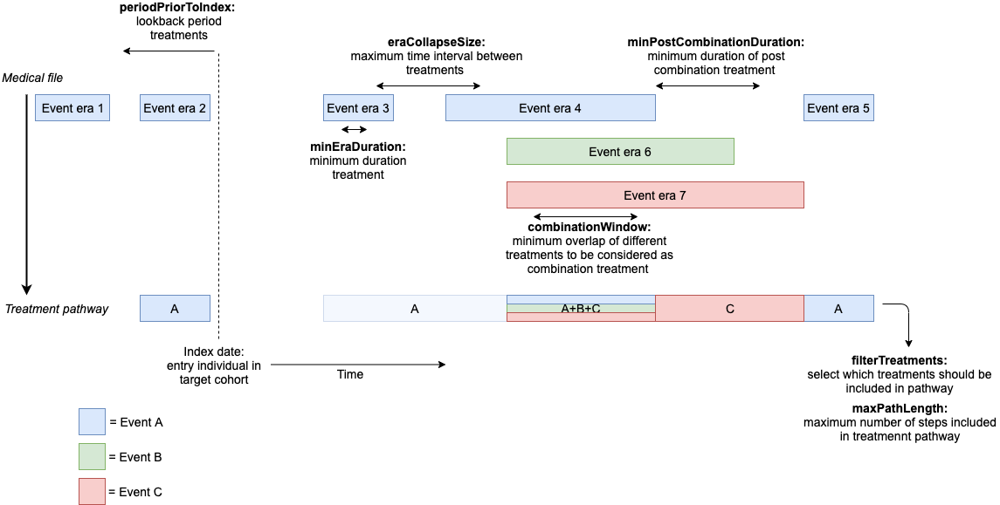

```{r setup, include = FALSE}
knitr::opts_chunk$set(
  collapse = TRUE,
  comment = "#>"
)
```

This vignette describes how to perform a treatment patterns study in five steps:

- Step 0: installation
- Step 1: define target/event cohorts (cohortSettings)
- Step 2: (optional, only for OMOP-CDM data) specify baseline characteristics of interest (characterizationSettings)
- Step 3: specify settings to construct treatment pathways (pathwaySettings)
- Step 4: execute study
- Step 5: check out results

In this vignette we will use an example describing the treatment patterns of hypertension patients. The included drugs of interests are hydrochlorothiazide, metorolol, amlodipine, lisinopril, and losartan (note: this example is purely for illustrative purposes - for simplicity we limit it to 5 events of interest).

# Step 0: installation

1. See the instructions [here](https://ohdsi.github.io/Hades/rSetup.html) for configuring your R environment, including RTools and Java.

2. In R, use the following commands to download and install TreatmentPatterns:

```r
install.packages("remotes")
remotes::install_github("mi-erasmusmc/TreatmentPatterns")
```

# Step 1: define target/event cohorts (cohortSettings)

The package works with cohorts, you need to define (at least one) target and (multiple) event cohorts. For each individual in a target cohort, the package extracts the event cohorts from the medical file after the index date. 

- Target cohort (= study population) is a set of patients who satisfy one or more inclusion criteria for a duration of time. When defining the target cohort it might be desirable to request a minimum follow up time after the index date to have sufficient information on treatment history. The index date of the target cohort is the point in time from which treatments of interest will be included in treatment pathways.

- Event cohort(s) (= treatment(s) of interest). You need to define a cohort for each treatment of interest (e.g. prescriptions of drugs, therapies, other treatments) that should be included in the treatment pathway.

Cohorts can be generated based on a definition in ATLAS (https://ohdsi.github.io/TheBookOfOhdsi/Cohorts.html) or imported directly in the package from a csv file. Cohorts have the following columns: 

```{r, fig.show='hold', echo=FALSE}
library('knitr')
table <- data.frame("Unique ID number","Unique person ID number","Entry date cohort", "Exit date cohort")
colnames(table) <- c("cohortId", "personId", "startDate", "endDate")
kable(table)
```
Date format: yyyy-mm-dd.


Note that there are multiple ways of defining target/event cohorts. For the example in this vignette, we defined the following target and event cohorts:
```{r tidy=FALSE,eval=FALSE}
### Example: target cohort - Hypertension

Cohort Entry Events:
  
  People with continuous observation of 365 days before and 1,095 days after event
may enter the cohort when observing any of the following: drug eras of
'Hypertension drugs'.

Limit cohort entry events to the earliest event per person.

Inclusion Criteria:
  
  1. Hypertension diagnosis: Entry events having at least 1 condition occurrence of
'Hypertension diagnosis', starting anytime up to 30 days after cohort entry start date;
allow events outside observation period.

2. Index year: Entry events with the following event criteria: starting after
December 31, 2009.

# Here we use the moment of drug exposure as index date,
# alternatively the moment of diagnosis could be used.
# This is a study design choice.
```

```{r tidy=FALSE,eval=FALSE}
### Example: event cohort - Hydrochlorothiazide 

Cohort Entry Events:
  
  People enter the cohort when observing any of the following: drug exposures of
'Hydrochlorothiazide'.

Limit cohort entry events to the earliest event per person.

Cohort Exit:
  
  The cohort end date will be based on a continuous exposure to 'Hydrochlorothiazide':
  allowing 0 days between exposures, adding 0 days after exposure ends, and using days
supply and exposure end date for exposure duration.

Cohort Eras:
  
  Entry events will be combined into cohort eras if they are within 30 days of each other.

### The other event cohorts (metorolol, amlodipine, lisinopril, losartan) are defined
### similarly 
```


# Step 2: (optional, only for OMOP-CDM data) specify baseline characteristics of interest (characterizationSettings)

Determine which covariates are of interest for baseline characterization and select these from the large set of pre-defined covariates as defined by *standardCovariateSettings* (as defined by createCovariateSettings function in FeatureExtraction package) or create (a) custom covariate(s) using SQL. One can choose to present "all" or only "selected" covariates as specified in *baselineCovariates*. When using a characteristic of interest from FeatureExtraction we need to make sure it is included in *standardCovariateSettings*. For the example in this vignette we use the following default characteristics in *baselineCovariates*:

```{r, fig.show='hold', echo=FALSE}
library('knitr')
table <- data.frame(covariateName = c('Male', 'Age', 
                                      'Charlson comorbidity index score'),
                    covariateId = c(8507001, 1002, 1901))
kable(table)
```

Code examples:
```{r tidy=FALSE,eval=FALSE}
# default return all covariates of standardCovariateSettings
characterizationSettings <- createCharacterizationSettings()

# return selection of covariates in default baselineCovariates (male, age, ccomorbidity index score)
characterizationSettings <- createCharacterizationSettings(returnCovariates = "selection")

characterizationSettings <-
  createCharacterizationSettings(baselineCovariates =
                                   data.frame(covariateName = c('Male', 'Age', 
                                                                'Charlson comorbidity index score'),
                                              covariateId = c(8507001, 1002, 1901)),
                                 returnCovariates = "selection")
```


# Step 3: specify settings to construct treatment pathways (pathwaySettings)

The settings below are part of *pathwaySettings* and allow the user to influence how the events of interest should be processed to form treatment pathways. For the example in this vignette we used the default settings:

```{r, fig.show='hold', echo=FALSE, fig.cap="Table with a list of parameters for *pathwaySettings*, with default values and description."}
library('knitr')
table <- data.frame(c("studyName", "targetCohortId", "eventCohortIds", "periodPriorToIndex", "minEraDuration","splitEventCohorts", "splitTime", "eraCollapseSize", "combinationWindow","minPostCombinationDuration","filterTreatments","maxPathLength","minCellCount", "minCellMethod","groupCombinations","addNoPaths"),c("default","1","10,11,12,13,14","0", "0","","30","30","30","30","First","5","5","Remove","10","FALSE"),
                    c("Unique name identifying the set of study parameters below", "Select one study population", "Select all treatments of interest", "Number of days prior to the index date of the target cohort that event cohorts are allowed to start", "Minimum time an event era should last to be included in analysis", "Specify event cohort to split in acute (< X days) and therapy (>= X days)", "Specify number of days (X) at which each of the split event cohorts should be split in acute and therapy", "Window of time between which two eras of the same event cohort are collapsed into one era", "Window of time two event cohorts need to overlap to be considered a combination treatment", "Minimum time an event era before or after a generated combination treatment should last to be included in analysis", "Select first occurrence of ('First') / changes between ('Changes') / all event cohorts ('All')", "Maximum number of steps included in treatment pathway", "Minimum number of persons with a specific treatment pathway for the pathway to be included in analysis", "Select to completely remove / sequentially adjust (by removing last step as often as necessary) treatment pathways below minCellCount", "Select to group all non-fixed combinations in one category 'other’ in the sunburst plot", "Select to include untreated persons without treatment pathway in the sunburst plot"))
colnames(table) <- c("param", "values", "description")
kable(table)
```

```{r, echo=FALSE, fig.cap="Visualizes some of the important parameters.", out.width = '100%'}
library(knitr)

```

Adjust the default parameters according to the needs of your study. It is possible to add multiple studies at the same time by specifying different sets of pathway settings with *addPathwaySettings*. Note: only when multiple settings are run at the same time, the results will be displayed together in the shiny application.

Code examples:
```{r tidy=FALSE,eval=FALSE}
# use all default settings, only specify targetCohortId and eventCohortIds (mandatory)
pathwaySettings <- createPathwaySettings(targetCohortId = 1, eventCohortIds = c(10, 11, 12, 13, 14))

pathwaySettings <- createPathwaySettings(
pathwaySettings_list =list(addPathwaySettings(studyName = c("default"),
                                              targetCohortId = 1,
                                              eventCohortIds = c(10, 11, 12, 13, 14))))

# specify different sets of pathway settings, with adjusted settings
pathwaySettings <- createPathwaySettings(
  pathwaySettings_list = list(addPathwaySettings(studyName = c("default"),
                                                 targetCohortId = 1,
                                                 eventCohortIds = c(10, 11, 12, 13, 14)),
                              addPathwaySettings(studyName = c("mineraduration"),
                                                 targetCohortId = 1,
                                                 eventCohortIds = c(10, 11, 12, 13, 14),
                                                 minEraDuration = 5)))

```


# Step 4: execute study

The complete treatment patterns study can be run with the following command after defining the setting objects (see Package manual for functions to create these): 
```{r tidy=FALSE,eval=FALSE}
TreatmentPatterns::executeTreatmentPatterns(dataSettings = dataSettings,
                                            cohortSettings = cohortSettings,
                                            characterizationSettings = characterizationSettings,
                                            pathwaySettings = pathwaySettings,
                                            saveSettings = saveSettings)
```

There are two main approaches to define setting objects:

A) by using function arguments when calling package functions (recommended) or,
B) by referring to pre-specified setting files in a folder.

We give the code for both approaches for databases in 'OMOP CDM' and 'other' format for the example in this vignette. One can try to run these examples to become familiar with the package. 

### OMOP CDM format - approach A) Using function arguments when calling package functions

Code example:
```{r tidy=FALSE,eval=FALSE}
library(TreatmentPatterns)
dataSettings <- createDataSettings(OMOP_CDM = TRUE,
                                   connectionDetails = DatabaseConnector::
                                     createConnectionDetails(dbms = Sys.getenv('dbms'),
                                                             server = Sys.getenv('server'),
                                                             user = Sys.getenv('user'),
                                                             password = Sys.getenv('password'),
                                                             port = Sys.getenv('port')),
                                   cdmDatabaseSchema = 'cdm',
                                   cohortDatabaseSchema = 'results',
                                   cohortTable = "treatmentpatterns_cohorts")

cohortSettings <-
  createCohortSettings(
    targetCohorts = data.frame(cohortId = c(1),
                               atlasId = c(1777380),
                               cohortName = c('Hypertension'),
                               conceptSet = ""),
    eventCohorts = data.frame(cohortId = c(10, 11, 12, 13, 14),
                              atlasId = c(1777381,1777382, 1777383, 1777384, 1777385),
                              cohortName = c('Hydrochlorothiazide', 'Metorolol',
                                             'Amlodipine', 'Lisinopril', 'Losartan'),
                              conceptSet = c("", "", "", "", "")),
    baseUrl = "http://api.ohdsi.org:8080/WebAPI",
    loadCohorts = TRUE)

characterizationSettings <-
  createCharacterizationSettings(baselineCovariates =
                                   data.frame(covariateName = c('Male', 'Age', 
                                                                'Charlson comorbidity index score'),
                                              covariateId = c(8507001, 1002, 1901)),
                                 returnCovariates = "selection")

pathwaySettings <- createPathwaySettings(targetCohortId = 1, eventCohortIds = c(10, 11, 12, 13, 14))

saveSettings <- createSaveSettings(databaseName = "IPCI", rootFolder = getwd())

TreatmentPatterns::executeTreatmentPatterns(dataSettings = dataSettings,
                                            cohortSettings = cohortSettings,
                                            characterizationSettings = characterizationSettings,
                                            pathwaySettings = pathwaySettings,
                                            saveSettings = saveSettings)
```


### OMOP CDM format - approach B) Referring to pre-specified setting files in a folder 

Code example:
```{r tidy=FALSE,eval=FALSE}
library(TreatmentPatterns)
dataSettings <- createDataSettings(OMOP_CDM = TRUE,
                                   connectionDetails = DatabaseConnector::
                                     createConnectionDetails(dbms = Sys.getenv('dbms'),
                                                             server = Sys.getenv('server'),
                                                             user = Sys.getenv('user'),
                                                             password = Sys.getenv('password'),
                                                             port = Sys.getenv('port')),
                                   cdmDatabaseSchema = 'cdm',
                                   cohortDatabaseSchema = 'results',
                                   cohortTable = "treatmentpatterns_cohorts")

cohortSettings <-
  createCohortSettings(
    cohortsToCreate_location =
      file.path(system.file(package = "TreatmentPatterns"),
                "examples", "OMOP CDM", "inst", "settings", "cohorts_to_create.csv"),
    cohortsFolder = file.path(system.file(package = "TreatmentPatterns"),
                              "examples", "OMOP CDM", "inst", "cohorts"))

characterizationSettings <-
  createCharacterizationSettings(baselineCovariates_location =
                                   file.path(system.file(package = "TreatmentPatterns"),
                                             "examples", "OMOP CDM", "inst", "settings", 
                                             "characterization_settings.csv"),
                                 returnCovariates = "selection")

pathwaySettings <-
  createPathwaySettings(pathwaySettings_location =
                          file.path(system.file(package = "TreatmentPatterns"),
                                    "examples", "OMOP CDM", "inst", "settings", "pathway_settings.csv"))

saveSettings <- createSaveSettings(databaseName = "IPCI", rootFolder = getwd())

TreatmentPatterns::executeTreatmentPatterns(dataSettings = dataSettings,
                                            cohortSettings = cohortSettings,
                                            characterizationSettings = characterizationSettings,
                                            pathwaySettings = pathwaySettings,
                                            saveSettings = saveSettings)
```

Format of files, see examples:

- inst/examples/OMOP CDM/inst/settings/cohorts_to_create.csv

- inst/examples/OMOP CDM/inst/settings/characterization_settings.csv

- inst/examples/OMOP CDM/inst/settings/pathway_settings.csv


### Other format - approach A) Using function arguments when calling package functions

Code example:
```{r tidy=FALSE,eval=FALSE}
library(TreatmentPatterns)
dataSettings <- createDataSettings(OMOP_CDM = FALSE,
                                   cohortLocation =
                                     file.path(system.file(package = "TreatmentPatterns"),
                                               "examples", "other format", "inst",
                                               "cohorts", "input_cohorts.csv"))

cohortSettings <-
  createCohortSettings(
    targetCohorts = data.frame(cohortId = c(1),
                               cohortName = c('Hypertension')),
    eventCohorts = data.frame(cohortId = c(10, 11, 12, 13, 14),
                              cohortName = c('Hydrochlorothiazide', 'Metorolol',
                                             'Amlodipine', 'Lisinopril', 'Losartan')),
    cohortsFolder = file.path(system.file(package = "TreatmentPatterns"),
                              "examples", "other format", "inst", "cohorts"))

pathwaySettings <- createPathwaySettings(targetCohortId = 1, eventCohortIds = c(10, 11, 12, 13, 14))

saveSettings <- createSaveSettings(databaseName = "IPCI", rootFolder = getwd())

TreatmentPatterns::executeTreatmentPatterns(dataSettings = dataSettings,
                                            cohortSettings = cohortSettings,
                                            pathwaySettings = pathwaySettings,
                                            saveSettings = saveSettings)
```


### Other format - approach B) Referring to pre-specified setting files in a folder 
Code example:
```{r tidy=FALSE,eval=FALSE}
library(TreatmentPatterns)
dataSettings <-createDataSettings(OMOP_CDM = FALSE,
                                  cohortLocation = file.path(system.file(package = "TreatmentPatterns"),
                                                             "examples", "other format", "inst",
                                                             "cohorts", "input_cohorts.csv"))

cohortSettings <-
  createCohortSettings(
    cohortsToCreate_location =
      file.path(system.file(package = "TreatmentPatterns"),
                "examples", "other format", "inst", "settings", "cohorts_to_create.csv"),
    cohortsFolder = file.path(system.file(package = "TreatmentPatterns"),
                              "examples", "other format", "inst", "cohorts"))

pathwaySettings <-
  createPathwaySettings(
    pathwaySettings_location =
      file.path(system.file(package = "TreatmentPatterns"),
                "examples", "other format", "inst", "settings", "pathway_settings.csv"))

saveSettings <- createSaveSettings(databaseName = "IPCI", rootFolder = getwd())

TreatmentPatterns::executeTreatmentPatterns(dataSettings = dataSettings,
                                            cohortSettings = cohortSettings,
                                            pathwaySettings = pathwaySettings,
                                            saveSettings = saveSettings)
```

Format of files, see examples:

- inst/examples/other format/inst/settings/cohorts_to_create.csv

- inst/examples/other format/inst/settings/pathway_settings.csv


# Step 5: check out results

- The results are combined in an automatically generated zip file per database

- Select the folder containing the zip files and run the Shiny App for an interactive visualization of the results:
```{r tidy=FALSE,eval=FALSE}
TreatmentPatterns::launchResultsExplorer(saveSettings = saveSettings)
TreatmentPatterns::launchResultsExplorer(outputFolder = file.path(saveSettings$rootFolder, "output"))
TreatmentPatterns::launchResultsExplorer(zipFolder = saveSettings$rootFolder)
```

- Note: the sunburst plots are only visible on a computer with internet due to JavaScript library dependencies.

- Share zip folder with results


# Extra options

## A) Stand alone sunburst plot functionality

```{r tidy=FALSE,eval=FALSE}
data <- readr::read_csv(file.path(system.file(package = "TreatmentPatterns"),
                                  "examples", "sequences.csv"),
                        col_types = list("c", "i"))
createSunburstPlot(data, folder = paste0(getwd(), "/output"),
                   file_name = "example", shiny = FALSE,
                   title = "example sequences.csv")
```

Note: the sunburst plots are only visible on a computer with internet due to JavaScript library dependencies.


## B) Custom cohorts (advanced - step 1)

Alternatively custom cohorts can be created using a concept set and template. In the package there is a cohort template available for drugs (inst/SQL/CohortDrugTemplate.sql). This template identifies all drug exposures of the concept set till the end of a continuous exposure with a maximum persistence window of 30 days. If you want to make use of this option, you need to specify the concepts set for each cohort of interest and specify whether or not to *includeDescendants*. 

## C) Custom covariates (advanced - step 2)

If desired, one can add custom covariates for characterization. An example template is given below: 

```{r tidy=FALSE,eval=FALSE}
SELECT @covariateId AS covariate_id,
{@aggregated} ? {
  cohort_definition_id,
  COUNT(DISTINCT target.@rowIdField) AS sum_value
} : {
  target.@rowIdField  AS row_id,
  1 AS covariate_value
}
FROM @cohortTable target
INNER JOIN @cdmDatabaseSchema.condition_occurrence covariate
ON covariate.person_id = target.@rowIdField 
WHERE covariate.condition_concept_id IN (..)
AND covariate.condition_start_date <= target.cohort_start_date
{@cohortId != -1} ? {AND cohort_definition_id IN (@cohortId)}
{@aggregated} ? {GROUP BY cohort_definition_id}
```

The custom covariates need to be specified in *baselineCovariates* with covariateId = "Custom".
